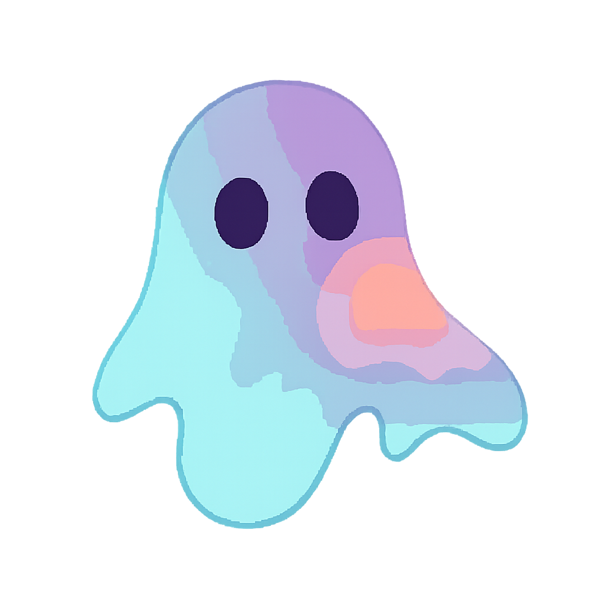

<div align="center">
    
</div>

<br>

<br>
<br>

### 👻 About me
I spend too much time online, talking on MSN. \
I daily drive Windows Vista on my brand new Coleco Adam machine. 

Email me to learn more! \
You can find my public gpg key [`here`](https://raw.githubusercontent.com/g5ostXa/g5ostXa/refs/heads/main/.g5ostXa_publickey.asc)

### What I'm working on:
* [`g5ostXa/hyprarch2 󰣇`](https://github.com/g5ostXa/hyprarch2) :     A pre-configured hyprland installer for Archlinux.
* [`g5ostXa/ghostshell`](https://github.com/g5ostXa/ghostshell) :     A very simple, yet elegant greeter for your terminal. Built with Go and lipgloss.
* [`g5ostXa/darkmatter`](https://github.com/g5ostXa/darkmatter) :     Simple TUI application to run linux utilities with style.
* [`g5ostXa/mnstrsay`](https://github.com/g5ostXa/mnstrsay) :         Just another cowsay-like program.

$${\color{cyan}=========================================================================================================}$$

```ruby
               MMM.           .MMM
               MMMMMMMMMMMMMMMMMMM
               MMMMMMMMMMMMMMMMMMM      _____________________________
              MMMMMMMMMMMMMMMMMMMMM    |                             |
             MMMMMMMMMMMMMMMMMMMMMMM   |      g5ostX2@proton.me      |
            MMMMMMMMMMMMMMMMMMMMMMMM   |_   _________________________|
            MMMM::- -:::::::- -::MMMM    |/
             MM~:~ 00~:::::~ 00~:~MM
        .. MMMMM::.00:::+:::.00::MMMMM ..
              .MM::::: ._. :::::MM.
                 MMMM;:::::;MMMM
          -MM        MMMMMMM
          ^  M+     MMMMMMMMM
              MMMMMMM MM MM MM
                   MM MM MM MM
                   MM MM MM MM
                .~~MM~MM~MM~MM~~.
             ~~~~MM:~MM~~~MM~:MM~~~~
            ~~~~~~==~==~~~==~==~~~~~~
             ~~~~~~==~==~==~==~~~~~~
                 :~==~==~==~==~~
```
